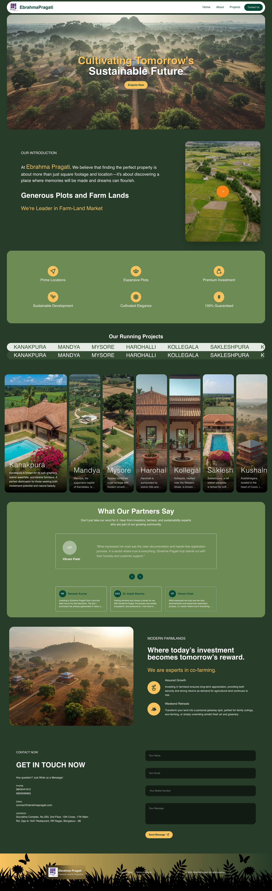
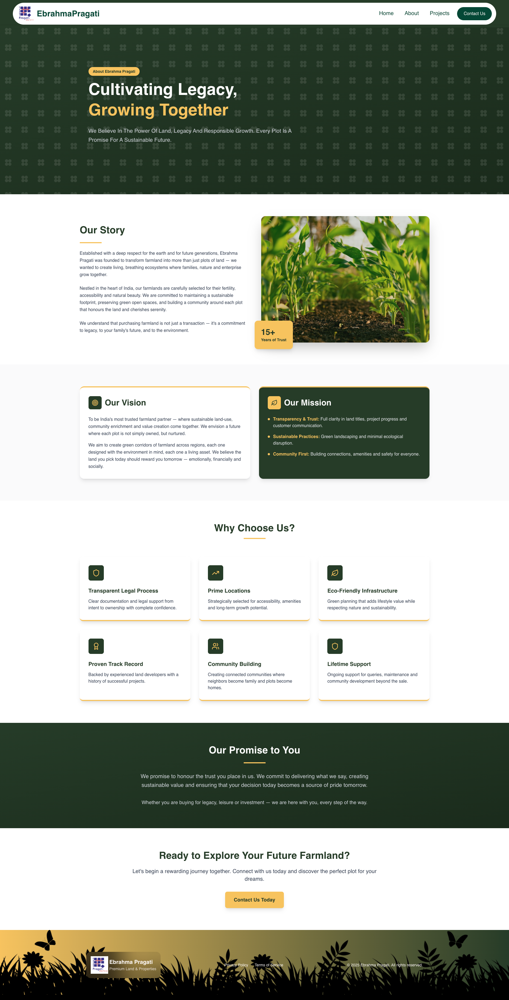
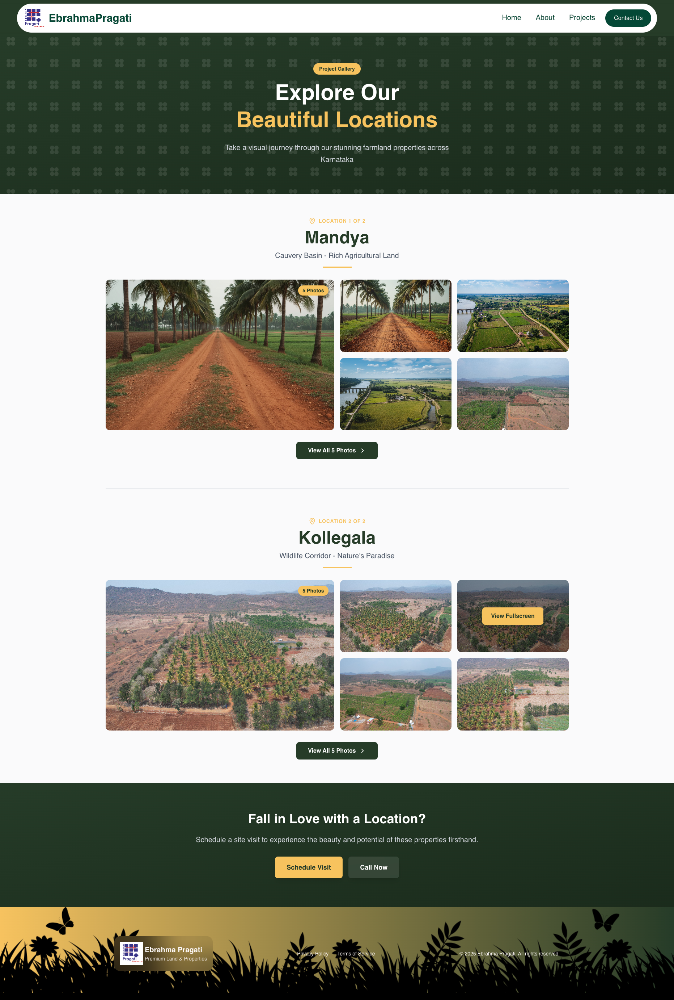

# Ebrahma Pragati — Premium Farmland & Resort-Plot Showcase 🌿

## 📄 Project Description

**Ebrahma Pragati** is a modern, responsive real-estate / farmland-plot web application built with **React.js + TypeScript** and **Tailwind CSS**. The site presents premium farmland and plots with project areas, land images, and detailed project information. It contains core pages like Home, About, and Projects — offering visitors a sleek, modern, polished user experience consistent with a premium real-estate brand.

## ✨ Features

- ⚡ **Fast & modern stack** – React with Vite for a snappy SPA experience and smooth navigation.
- 🎨 **Responsive UI with Tailwind CSS** – Fully mobile-friendly layout optimized for phones, tablets, and desktops.
- 🧭 **Client-side routing** – Navigation powered by `react-router` for an app-like experience.
- 📩 **Contact & enquiry forms** – Integrated with **Web3Forms** to send submissions directly to email (no custom backend required).
- 🎬 **framer-motion** – for smooth animations, transitions, and enhanced UI/UX.
- 📟 **react-fast-marquee** – It provides a marquee / banner animations / promotional strips.
- ✅ **Form validation & UX** – `react-hook-form` for validation and `react-toastify` for instant feedback (success/error toasts).
- 🖼️ **Iconography** – Clean icon set using `react-icons` & `lucide-react` for consistent visual language.

## 💡 Project Highlights

- **Real-world client build** – Responsive, mobile-first design, looks great across devices.
- **Clean, premium-looking UI aesthetic** – color palette, layout, typography aligned to real-estate branding.
- **Pages: Home, About, Projects** – with project listings showcasing farmland / resort-plots, project area, images, descriptions. Image galleries / project visuals to give a real feel of plots & farmland.
- **Backend-free form handling** – Web3Forms handles all form submissions via email, simplifying deployment and hosting.
- **Production-focused decisions** – Libraries chosen with long-term maintainability and readability in mind (routing, forms, animations, notifications)

## 🛠 Tech Stack

**Core:**

- [React](https://react.dev/)
- [Vite](https://vitejs.dev/)
- [Tailwind CSS](https://tailwindcss.com/)
- [React Router](https://reactrouter.com/)

**Forms & UX:**

- [Web3Forms](https://web3forms.com/) – serverless form handling via email
- [react-hook-form](https://react-hook-form.com/) – form state & validation
- [react-toastify](https://fkhadra.github.io/react-toastify/) – toast notifications

**UI Enhancements:**

- [framer-motion](https://www.npmjs.com/package/framer-motion) – smooth animation library for react
- [react-fast-marquee](https://www.npmjs.com/package/react-fast-marquee) – For marquee strip like moving design
- [react-icons](https://react-icons.github.io/react-icons/) – icons

## 📁 Project Structure (Overview)

```txt
src/
  ├─ components/      # Reusable UI components (Navbar, Footer, HeroBanner,         ProjectCard / PlotCard, ContactForm, etc.)
        ├─ UI         # Reusabale block (avatar, button, card, etc)
  ├─ hooks/           # use-mobile.tsx component
  ├─ lib/             # utils.ts
  ├─ pages/           # Route-level components/pages (About, Projects)
  ├─ Home.tsx         # Landing page of the website
  ├─ index.css        # Global css and reusable class of css
  ├─ App.tsx          # Main app container, routing & layout
  └─ main.tsx         # React + Vite entry point

```

## 🚀 Getting Started

Prerequisites

- Node.js (LTS version recommended)
- npm or yarn

## Installation & Development

Clone the project

```bash
  git clone https://github.com/Ajoy-paul11/Ebrahma-Pragati.git
```

Go to the project directory

```bash
  cd Ebrahma-Pragati
```

Install dependencies

```bash
  npm install
    or
  yarn install
```

Run development server

```bash
  npm run dev
    or
  yarn dev
```

Build for production

```bash
  npm run build
    or
  yarn build
```

## 🔐 Forms & Web3Forms Setup

This project uses Web3Forms to handle form submissions without a custom backend.

- Create a free account at [Web3Forms](https://web3forms.com/)
- Obtain your access key from the Web3Forms website.

In your form component, include the access key as a hidden input:

```javascript
<form method="POST" action="https://api.web3forms.com/submit">
  <input type="hidden" name="access_key" value="YOUR_WEB3FORMS_ACCESS_KEY" />
  {/* Your other form fields */}
  <input type="text" name="name" placeholder="Your Name" required />
  //...Other input fields
</form>
```

- Optionally, wrap the submission in react-hook-form for validation and use react-toastify to show success/error messages.

## 📸 Screenshots

|                    🏠 Home Page                     |                     🍀 About Page                     |                      🔰 Project Page                      |
| :-------------------------------------------------: | :---------------------------------------------------: | :-------------------------------------------------------: |
|  |  |  |

## 🌐 Live Website

- Website: [ebrahmapragati.com](https://ebrahmapragati.com/)

## 📄 License

#### 1. This project was developed for [Pragati Group]()

#### 2. You may reuse the structure and code patterns for learning purposes.

#### 3. Commercial reuse of the exact design, content, or branding may be restricted based on the client’s terms.

## 👨‍💻 Authors

#### Ajoy Paul - Full-Stack Developer

- Github: [@Ajoy-paul11](https://www.github.com/Ajoy-paul11)
- Portfolio: https://portfolio-ajoy-paul.vercel.app
- LinkedIn: [Ajoy Paul](https://www.linkedin.com/in/ajoypaul)
